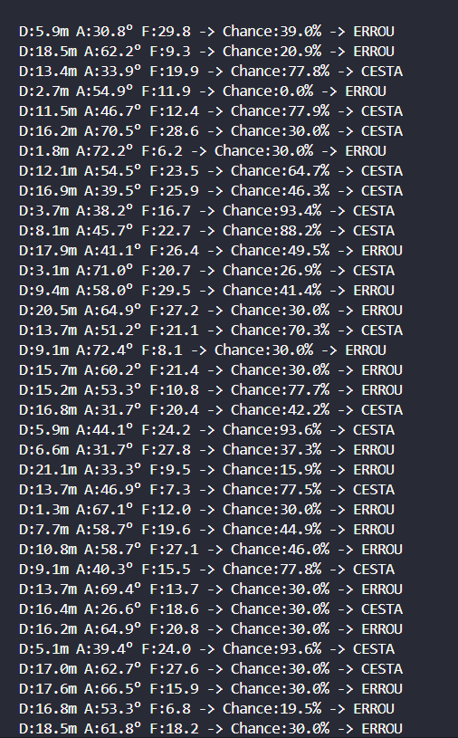
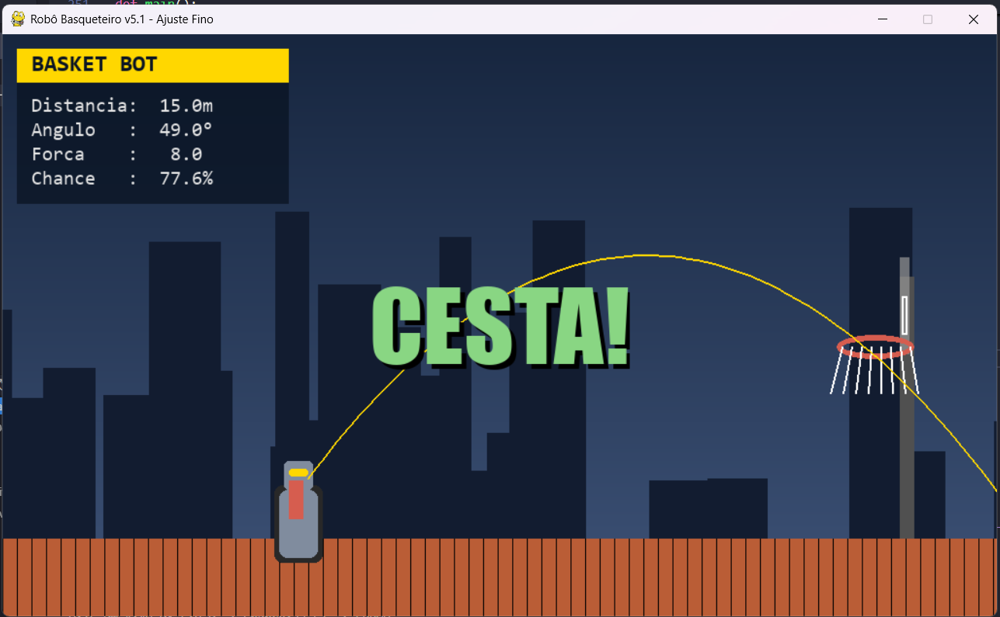

# 🤖🏀 Robô Basqueteiro v3.1.4 - Simulador com Lógica Nebulosa (Fuzzy Logic)

## Grupo:

-   Matheus Ferreira Bruno Bastos
-   Gabriel Ripper
-   Gabriel Pimenta
-   Kelwyn Reis
-   Guilherme Coelho

Este projeto é um simulador visual interativo de um robô que arremessa bolas de basquete, utilizando **lógica nebulosa (fuzzy logic)** para atrvés de nosso sistema termos a **chance de acerto** de cada arremesso com base nos parâmetros de entrada: **distância, ângulo e força**.

---

## 📌 Objetivo

Simular arremessos de um robô com "cérebro" baseado em **lógica nebulosa**, demonstrando como decisões podem ser tomadas não tomando apenas valores binários como base(vai acertar ou não vai acertar).

---

## 🧠 Lógica Nebulosa (Fuzzy Logic)

### 🧩 O que é Lógica Fuzzy?

A lógica fuzzy (ou lógica nebulosa) permite trabalhar com **incertezas** e **valores contínuos**, em vez de decisões binárias. Ela é útil quando lidamos com conceitos subjetivos como:

-   "distância curta"
-   "ângulo ideal"
-   "força fraca"
-   "chance alta de acerto"

---

## 🔢 Estrutura da Lógica Fuzzy em nosso projeto

### 🔸 Entradas (Inputs)

-   **Distância (`distancia`)** — de 0 a 25 metros

    -   `muito_curta`, `curta_ideal`, `media`, `longa`

-   **Ângulo (`angulo`)** — de 0 a 90 graus

    -   `baixo`, `medio_ideal`, `alto`

-   **Força (`forca`)** — de 0 a 30 (não é nenhuma unidade já conhecida e sim um esquema que nós mesmos criamos)
    -   `fraca`, `ideal`, `forte`

### 🔹 Saída (Output - Consequent)

-   **Chance de Acerto (`chance`)** — de 0% a 100%
    -   `minima`, `baixa`, `media`, `alta`, `altissima`

---

## 📈 Funções de Membresia

As categorias fuzzy são representadas por **funções de membresia**, que indicam o grau de pertencimento de um valor a uma categoria.

### 🔷 Exemplo 1 — Função Triangular:

```python
distancia['muito_curta'] = fuzz.trimf(distancia.universe, [0, 1, 4])
distancia['curta_ideal'] = fuzz.trimf(distancia.universe, [3, 6, 9])
distancia['media'] = fuzz.trimf(distancia.universe, [8, 13, 17])
distancia['longa'] = fuzz.trimf(distancia.universe, [16, 20, 25])

angulo['baixo'] = fuzz.trimf(angulo.universe, [0, 20, 35])
angulo['medio_ideal'] = fuzz.trimf(angulo.universe, [30, 48, 60])
angulo['alto'] = fuzz.trimf(angulo.universe, [55, 75, 90])
```

-   O valor **6** é 100% "curta ideal".
-   Os valores **3** e **9** são 0%.
-   Valores intermediários (ex: 4.5) têm pertinência parcial (~50%).

### 🔷 Exemplo 2 — Função Gaussiana:

```python
forca['ideal'] = fuzz.gaussmf(forca.universe, mean=18, sigma=4)
```

-   A força ideal tem pico em **18**.
-   Os valores ao redor diminuem suavemente a pertinência.

---

## 📜 Regras (Rules)

As **regras fuzzy** conectam as entradas com a saída, formando a inteligência do sistema. Elas seguem o formato:

> SE ... E ... ENTÃO ...

### 🧠 Exemplos:

#### Regra #1 — Exemplo de Arremesso Perfeito

```python
SE distancia = curta_ideal E angulo = medio_ideal E forca = ideal
ENTÃO chance = altissima
```

#### Regra #5 — Um Arremesso Difícil

```python
SE distancia = longa E angulo = medio_ideal E forca = forte
ENTÃO chance = media
```

#### Regra #10 — Um Arremesso Ruim

```python
SE distancia = longa E forca = fraca
ENTÃO chance = minima
```

O sistema avalia todas as **11 regras simultaneamente** para chegar a uma **conclusão ponderada**.

---

## ⚙️ Como Funciona a Simulação em 3 Passos

### 1. Fuzzificação

Converte os valores exatos (ex: distância = 7.5m) em **graus de pertinência** para cada categoria fuzzy.

### 2. Inferência

Aplica todas as regras fuzzy com base nos graus de pertencimento, e combina os resultados.

### 3. Defuzzificação

Converte o resultado fuzzy da saída em um **valor exato**, por exemplo:

```text
Chance = 82.3%
```

Esse valor é então usado para determinar se o robô acerta ou erra a cesta.

---

## 🎮 Visualização Gráfica com Pygame

A interface gráfica torna os conceitos abstratos da lógica fuzzy **visíveis e fáceis de entender**:

-   **📊 Placar Informativo:**.
-   **🏀 Animação Inteligente:**
-   **🌆 Cenários Aleatórios:** A cada rodada, novos valores são sorteados.

---

## 🚀 Exemplos e Imagens

### Situações reais dentro da nossa simulação!

-   Terminal com algumas situações:

    -   

-   Um exemplo de arremesso:
    -   

---

## 📚 Conclusão

## Este projeto demonstra como a **lógica fuzzy** pode ser usada para simular **decisões subjetivas**, como calcular a chance de sucesso em um arremesso de basquete.
